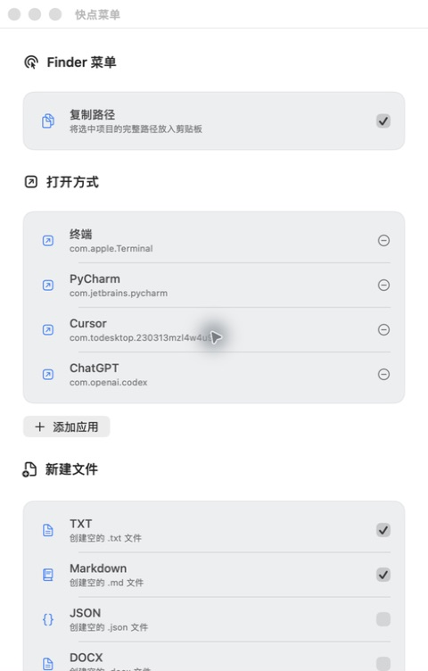

# 快点菜单

## 主要作用

为 macOS Finder 添加常用右键操作：

- 用指定应用打开文件或文件夹。
- 拷贝文件或文件夹的完整路径。
- 新建 TXT、Markdown、JSON、DOCX、PPTX、XLSX 文件，同名自动编号。
- 在菜单栏设置常用应用、文件类型和生效目录。

## 界面



## 支持系统

- macOS 13 及以上。
- Universal 应用，包含 Apple Silicon（M 系列）和 Intel 架构；Intel 真机尚未验证。

[下载快点菜单](https://github.com/MaoLikeQvQ/quick-menu/releases/latest)

## 移除下载属性

解压下载包，将 **快点菜单.app** 拖入“应用程序”文件夹。如果 macOS 阻止打开，确认下载来源后，在终端执行：

```sh
xattr -dr com.apple.quarantine "/Applications/快点菜单.app"
open "/Applications/快点菜单.app"
```

应用安装在其他位置时，请替换命令中的路径。当前应用尚未进行 Apple 公证，以上命令仅移除该应用的下载隔离属性。

打开应用后，在系统设置的 **Finder 扩展**中启用快点菜单，即可在配置的生效目录内使用右键操作。
